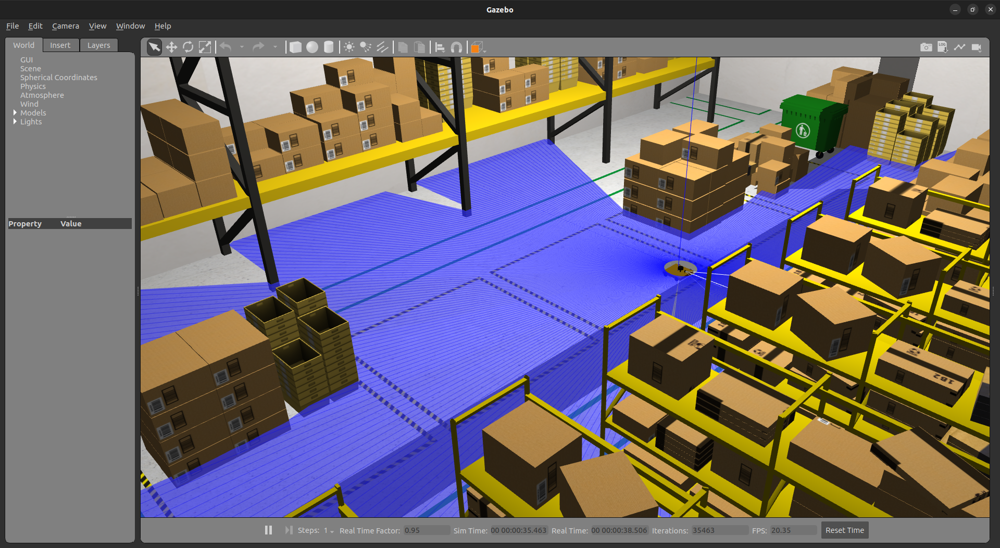
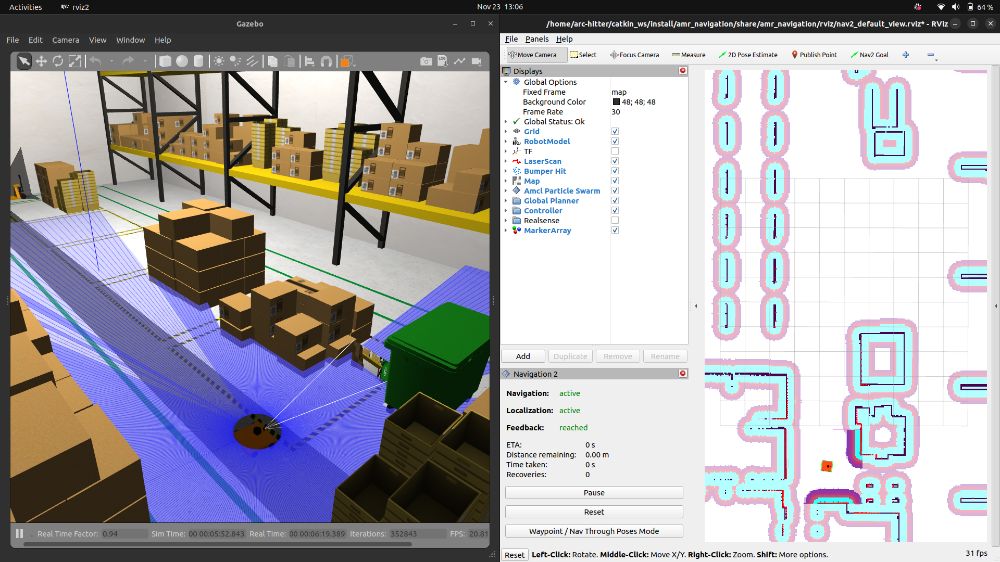

# Installation:

- ROS Humble Installation Documentation: (install ros-humble desktop)
> https://docs.ros.org/en/humble/Installation/Ubuntu-Install-Debians.html

- Install Gazebo for simulation environment:
> https://classic.gazebosim.org/tutorials?tut=install_ubuntu&cat=install
> Note: Source gazebo setup file if any plugin or files are not loading `source /usr/share/gazebo/setup.sh`

- Install Gazebo ROS Packages and Plugins for ros-humble:
```bash
sudo apt install ros-humble-gazebo-ros-pkgs
sudo apt-get install ros-humble-gazebo-plugins
```

- Install other necessary packages:
```bash
sudo apt-get install ros-humble-xacro
sudo apt-get install ros-humble-joint-state-publisher
sudo apt-get install ros-humble-joint-state-publisher-gui
```

- Install Nav2 components:
```bash
sudo apt install ros-humble-navigation2
sudo apt install ros-humble-nav2-bringup
sudo apt install ros-humble-slam-toolbox
sudo apt install ros-humble-robot-localization
```

# Execution Instructions:

- Firstly, launch the gazebo world:
> `ros2 launch aws_robomaker_small_warehouse_world small_warehouse.launch.py`


- Then, launch this file for mapping and save the maps:
> `ros2 launch amr_navigation amr_mapping.launch.py`

- Once map is saved, launch this file for navigation:
> `ros2 launch amr_navigation amr_navigation.launch.py`

